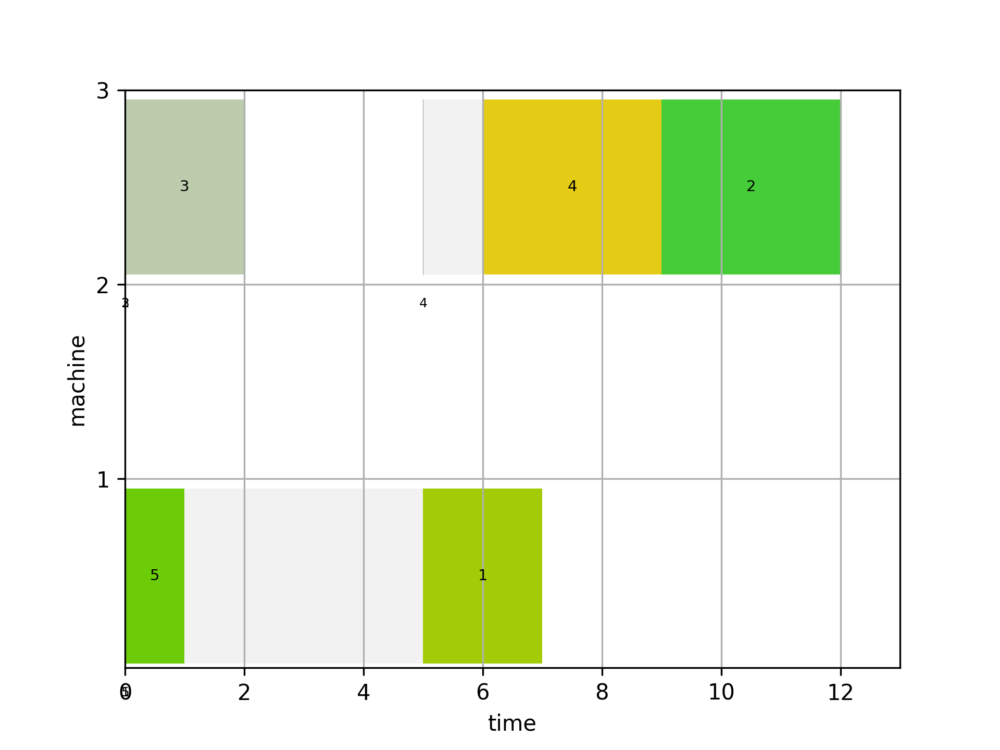

# Tuning of Answer-Set-Programming Encoded Scheduling Problems
This is the repository of my bachelor thesis. This work deals with tuning of *parallel machine scheduling with sequence-dependent setup times and release dates*. We use *Answer-Set-Programming* (ASP) with the solver [clingo](https://potassco.org/clingo/) to determine a minimal schedule under makespan objective. This repository contains all our approaches to enhance parallel machine scheduling with ASP.

## Repository Structure

### [cluster-experiments](./cluster-experiments)
This contains all the experiments for the cluster benchmarks.
We use `HTCondor 8.4.2` for parallelization of our benchmarks.
All applications below must be installed by hand on the cluster machines. I recommend to install python3 and [conda](https://docs.conda.io/en/latest/) in the user directory. Then, using conda to install the remaining applications. The cluster has to support a shared filesystem, otherwise the applications must be installed on each cluster machine. It should also be noted that the binary locations are hardcoded into the experiment files.

| Application | Version |
|-------------|---------|
| python      | 3.9.5   |
| clingo      | 5.5.1   |
| clingo-dl   | 1.2.1   |
| clingcon    | 5.0.1   |

---

### [encodings](./encodings)
This contains all our encodings. We wrote various encodings for the solvers [clingo](https://potassco.org/clingo/), [clingcon](https://potassco.org/clingcon/) and [clingo-dl](https://github.com/potassco/clingo-dl):

* [`clingcon/`](./encodings/clingcon/) Clingcon encodings.
* [`clingo/`](./encodings/clingo/) Basic clingo encodings without theory solving.
* [`clingo-dl/`](./encodings/clingo-dl/) Clingo-dl encodings.
* [`former_encodings/`](./encodings/former_encodings/) Encodings of a former paper. Also contains the baseline for the benchmarks.
* [`generators/`](./encodings/generators/) Partial encodings for generation of the search space.
* [`heuristics/`](./encodings/heuristics/) Partial encodings for heuristic.
* [`thesis-examples/`](./encodings/thesis-examples/) Example encodings for the bachelor-thesis.

---

### [instances](./instances)
This contains the instance generators. 
The instance files have to be generated by executing:
```shell
chmod a+x ./instances/create_instances.sh && ./instances/create_instances.sh
```

---

### [smac-wrapper](./smac-wrapper)
This contains the smac to clingo wrapper for parameter tuning. See [smac-wrapper/README.md](./smac-wrapper/README.md) for more information about the installation and usage.

---

### [utils](./utils)
This contains scripts to simplify the developing and testing of ASP programs.
The tools belows can be installed with `python -m pip install ./utils`.
| Utils       | Description                                                                                    |
|-------------|------------------------------------------------------------------------------------------------|
| gantt       | creates gantt graphs based on answer sets.                                                     |

Use `--help` (e.g. `gantt --help`) for more information about the usage.


## Local Installation and Usage:

You can test the encodings locally:

To install the required dependencies with conda, run in the project dir:
```shell
conda create --name clingodev \
conda activate clingodev \
conda install -c potassco/label/dev clingo clingo-dl clingcon \
python -m pip install ./utils
```
Then, a gantt chart can be generated by executing:
```console
clingo-dl encodings/clingo-dl/01_clingodl.lp instances/simple_instance.lp utils/gantt.lp --minimize-variable=makespan | gantt -o ./01_clingodl_simple_instance.png
```
<p align="left">
  
</p>
